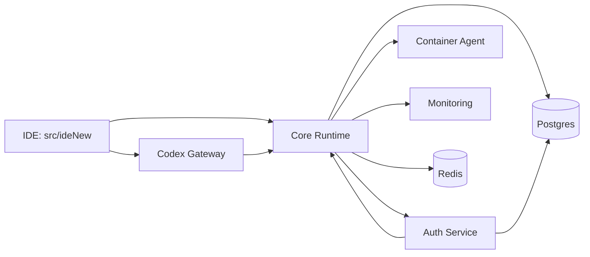

```mermaid
graph LR
  IDE[IDE: src/ideNew] --> CORE[Core Runtime]
  CORE --> AUTH[Auth Service]
  CORE --> AGENT[Container Agent]
  CORE --> MON[Monitoring]
  IDE --> GATEWAY[Codex Gateway]
  GATEWAY --> CORE
  AUTH --> CORE
  CORE --> REDIS[(Redis)]
  CORE --> POSTGRES[(Postgres)]
  AUTH --> POSTGRES
```

This graph reflects runtime dependencies and service calls, not npm package dependencies.
